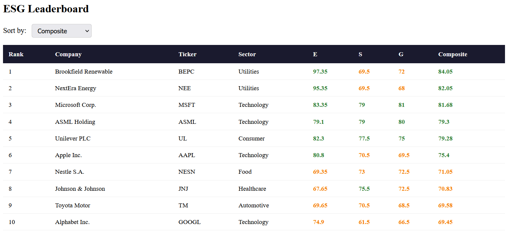
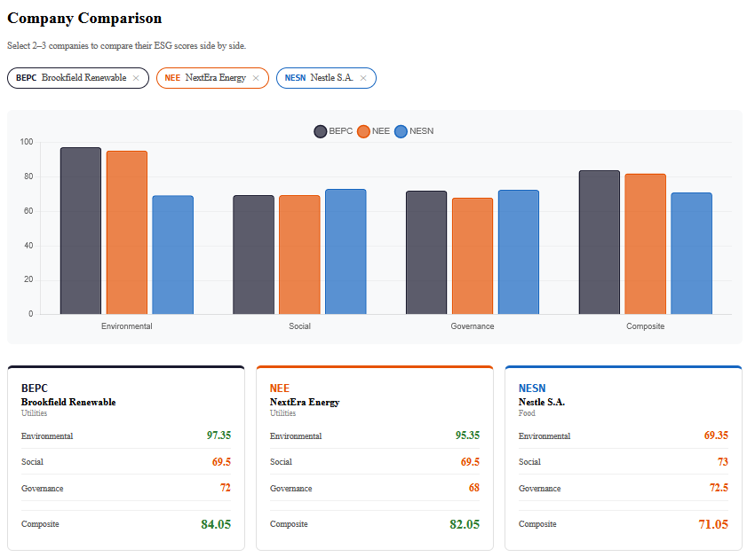
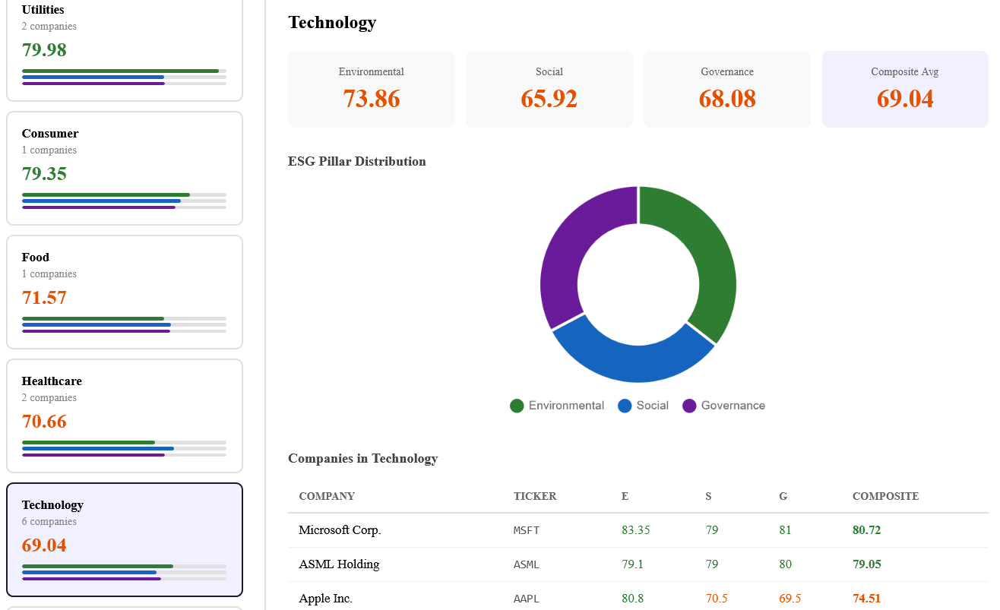
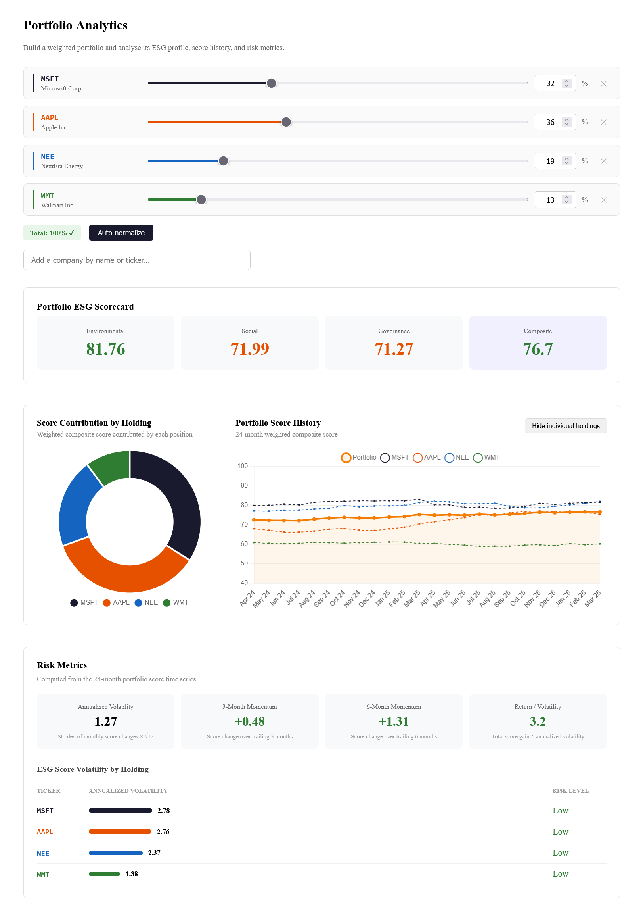
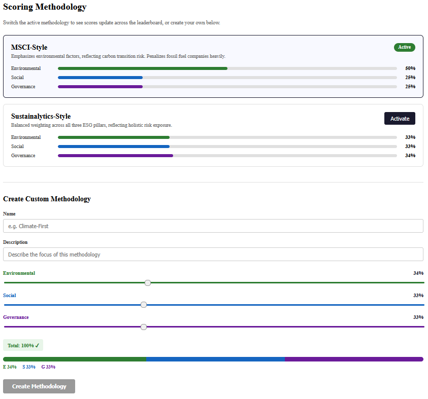

# ESG Scoring Platform

A full-stack ESG (Environmental, Social, Governance) scoring platform built with Java, Spring Boot, Angular, MongoDB, and Docker. The platform scores and ranks companies across E, S, and G pillars using configurable weighted methodologies, and generates realistic historical score simulations using a Merton jump-diffusion model with sector-specific GBM drift and compound Poisson jumps — representing real corporate events such as emissions commitments, governance overhauls, and regulatory penalties.

## Screenshots

**Leaderboard** — sortable company rankings under the active scoring methodology


**Company Detail** — per-pillar score cards with a 24-month score history chart driven by the jump-diffusion simulation


**Sector Analytics** — aggregated E/S/G averages by sector with pillar distribution and company-level breakdowns


**Portfolio Analytics** — weighted portfolio ESG scoring, score contribution by holding, 24-month history, and risk metrics including annualized volatility and momentum


**Methodology Builder** — runtime methodology switching and custom E/S/G weight configuration with live preview


## Features

- **Configurable scoring methodologies** — switch between predefined methodologies (MSCI-style, Sustainalytics-style) or build custom ones with adjustable E/S/G weightings at runtime
- **Historical simulation** — 24 months of monthly scorecards per company generated via GBM with jump diffusion, anchored to research-grounded seed metrics
- **Sector analytics** — aggregated E/S/G averages by sector with pillar distribution charts and company-level breakdowns
- **Portfolio analytics** — weighted portfolio ESG scoring with annualized volatility, momentum indicators, and per-holding risk breakdown
- **Company comparison** — side-by-side E/S/G score comparison across 2–3 companies with grouped bar charts
- **Company detail views** — score history line charts, raw metric tables, and per-pillar score cards
- **Leaderboard** — sortable ranking across all companies under the active methodology
- **REST API** — full CRUD with role-based access control; GET endpoints are public, write endpoints require authentication

## Stack

| Layer | Technology |
|---|---|
| Backend | Java 19, Spring Boot 4.0.5, Spring Security |
| Frontend | Angular 21, Chart.js, nginx |
| Database | MongoDB 7 |
| DevOps | Docker, Docker Compose |

## Getting Started

### Prerequisites

- [Docker Desktop](https://www.docker.com/products/docker-desktop/) installed and running

No other dependencies required — Java, Node.js, and MongoDB all run inside containers.

### Running the Application

```bash
git clone https://github.com/nashwanhabboosh/ESG-scoring.git
cd ESG-scoring
docker-compose up --build
```

The backend takes roughly 20–30 seconds to initialize. Once you see `Started EsgplatformApplication in XX seconds` in the logs, the application is ready.

- **Frontend:** http://localhost:4200
- **API:** http://localhost:8080/api/companies

### Stopping

```bash
docker-compose down          # stop containers
docker-compose down -v       # stop and remove persisted data
```

## API Authentication

GET endpoints are publicly accessible. POST, PUT, and DELETE endpoints require HTTP Basic Authentication:

| Field | Value |
|---|---|
| Username | `admin` |
| Password | `esg-admin-2024` |

## Testing

The test suite runs against a live MongoDB instance. Start the database container first, then run the suite:

```bash
docker-compose up mongodb -d
./mvnw test
```

25 tests across unit, repository integration, and controller integration layers.